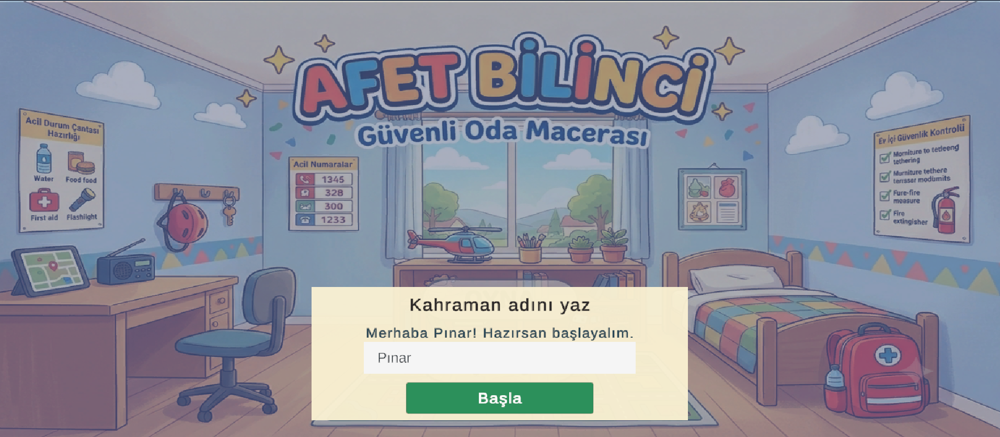
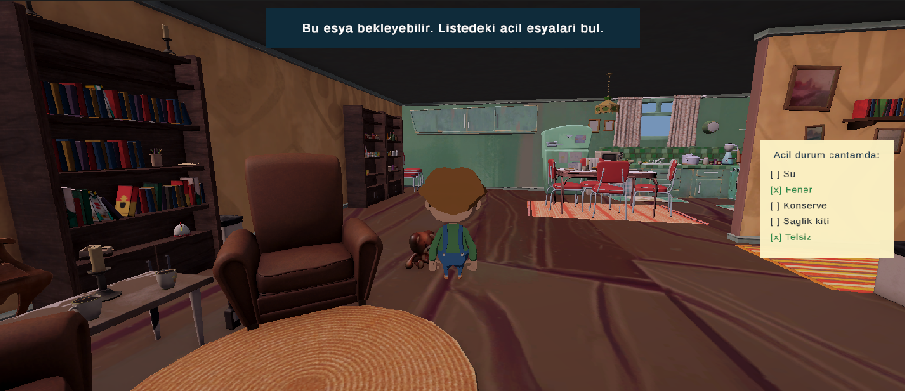
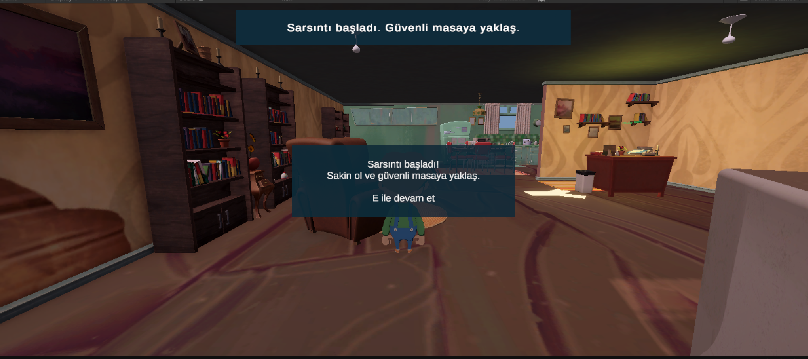
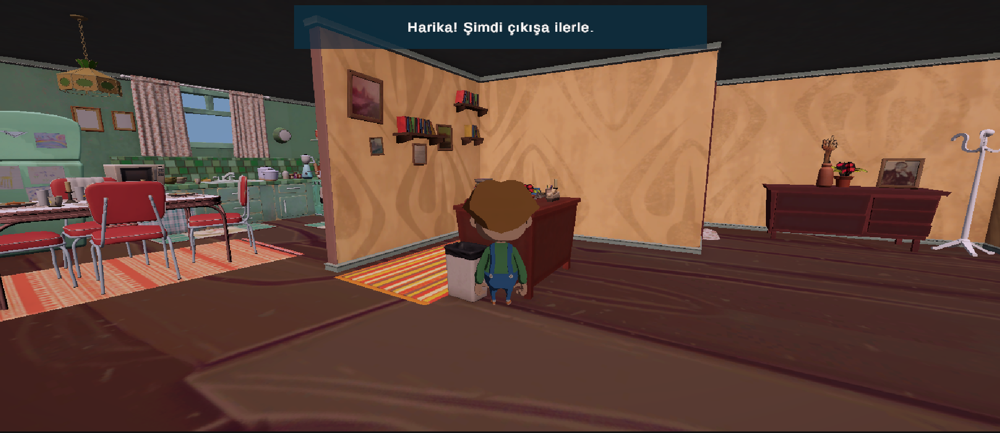
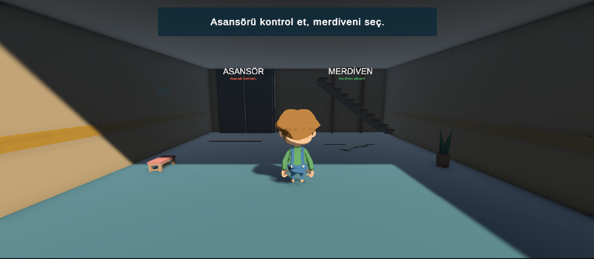
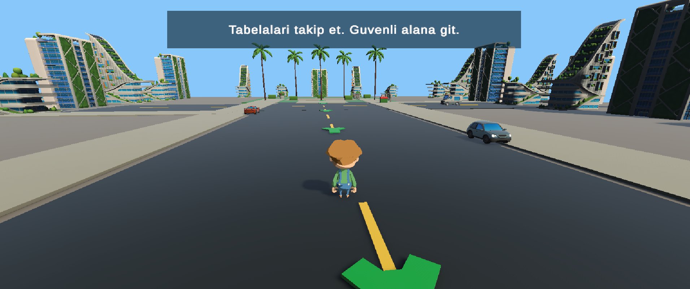
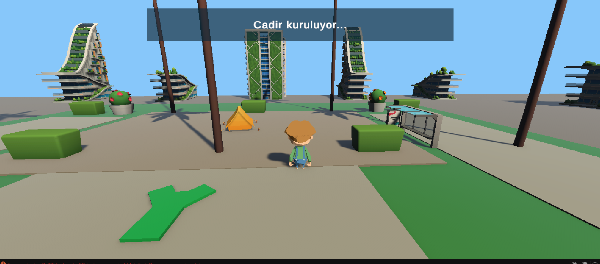
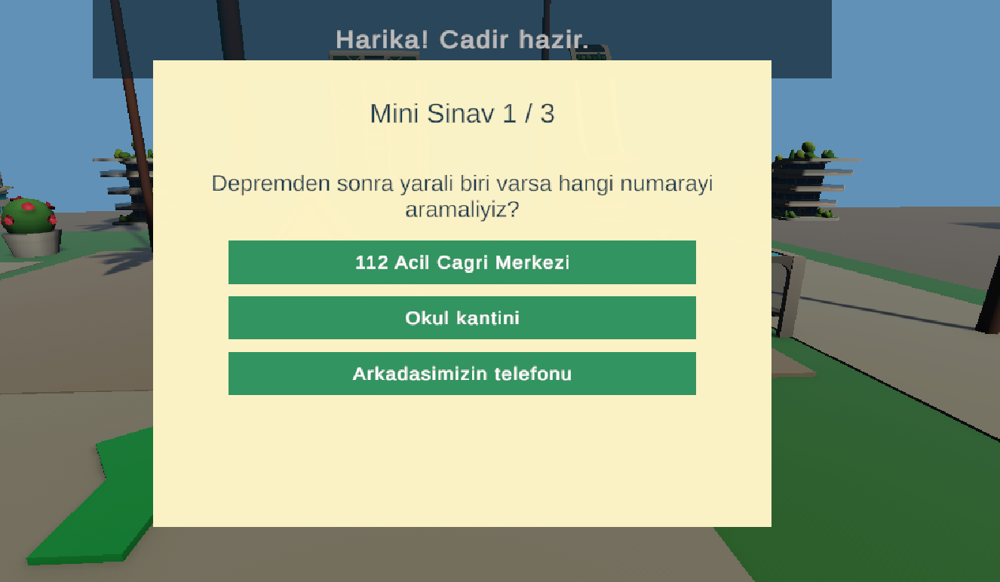
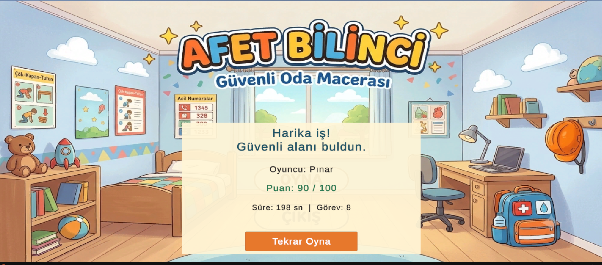

# Afet Bilinci 3D: Guvenli Oda Macerasi

Afet Bilinci 3D, ilkokul cagindaki cocuklar icin gelistirilmis 3D, hikaye temelli ve game-based learning odakli bir afet bilinci oyunudur. Proje, cocuklari korkutmak yerine guvenli davranislari deneyimleyerek ogrenmelerini hedefler.

Oyuncu, ev ortaminda acil durum cantasi hazirlar, sarsinti sirasinda guvenli bir alana yonelir, binadan tahliye olur, merdiven/asansor tercihini degerlendirir, acik alandaki toplanma bolgesine ulasir ve kisa bir mini sinavla ogrendiklerini pekistirir.

## Egitim Amaci

Bu proje, afet bilinci egitimini cocuklarin bilissel seviyesine uygun, kisa yonlendirmelerle desteklenen ve guvenli davranis pratikleri iceren bir oyun deneyimine donusturur.

Onemli tasarim ilkeleri:

- Travmatik, siddetli, kanli veya asiri tetikleyici sahneler kullanilmaz.
- Deprem ve tahliye konulari korku uzerinden degil, dogru davranisi ogretme uzerinden anlatilir.
- Metinler kisa, okunakli ve cocuklarin takip edebilecegi sadeliktedir.
- Gorevlerde `E tusuna bas` veya `E tusuna basili tut` gibi net eylem komutlari kullanilir.
- Yanlis secimler cezalandirici degil, ogretici geri bildirimlerle desteklenir.
- Son bolumde mini sinav ile 112 Acil Cagri Merkezi ve guvenli alan bilgisi pekistirilir.

## Oyun Akisi

1. Oyuncu adini girer ve maceraya baslar.
2. Evde acil durum cantasi icin gerekli esyalari toplar.
3. Sarsinti basladiginda guvenli masaya yonelir ve cok-kapan-tutun davranisini uygular.
4. Evden cikisa ilerler.
5. Apartman koridorunda asansor ve merdiven seceneklerini degerlendirir.
6. Dis alanda tabelalari ve ok isaretlerini takip ederek guvenli toplanma alanina gider.
7. Toplanma alaninda cadir kurma gorevini tamamlar.
8. 3 soruluk mini sinavla ogrendiklerini pekistirir.
9. Skor ekraninda toplam puan, sure ve tamamlanan gorevler goruntulenir.

## Ekran Goruntuleri

### 1. Giris Ekrani

### 2. Acil Durum Cantasi Hazirlama

### 3. Sarsinti ve Guvenli Alan

### 4. Evden Cikis

### 5. Apartman Koridoru

### 6. Guvenli Alana Yonlendirme

### 7. Cadir Kurma Gorevi

### 8. Mini Sinav

### 9. Skor Ekrani

## Temel Ozellikler

- 3D cocuk karakteri ve kamera takip sistemi
- Cocuk dostu gorev metinleri
- Acil durum cantasi kontrol listesi
- Etkilesimli esya toplama sistemi
- Guvenli alan vurgusu
- Cok-kapan-tutun gorevi
- Merdiven/asansor farkindaligi
- Guvenli toplanma alani ve cadir kurma gorevi
- 112 odakli mini sinav
- Puan, sure ve gorev sayisi iceren sonuc ekrani

## Teknik Bilgiler

- Motor: Unity 6.3 LTS
- Render Pipeline: URP
- Platform: Windows, Mac, Linux Standalone
- Dil: C#

Projeyi acmak icin:

1. Unity Hub uzerinden projeyi acin.
2. Unity surumu olarak `6000.3.10f1` veya uyumlu Unity 6.3 LTS kullanin.
3. Ilk acilista Unity'nin assetleri import etmesini bekleyin.
4. Baslangic sahnesi: `Assets/Scenes/GirisEkrani.unity`

## GitHub Notu

Bu projede ucuncu parti Unity asset paketleri kullanilmistir. Asset lisanslarina dikkat edilmelidir. Eger Asset Store paketlerinin yeniden dagitimi konusunda emin degilseniz repoyu private olarak tutmaniz onerilir.

Bu GitHub reposu, proje tanitimi, ekran goruntuleri, Unity ayarlari ve C# kaynak kodlarini paylasmak icin hazirlanmistir. Buyuk 3D asset dosyalari repoya eklenmemistir; yerel Unity projesinde korunur.

Import edilmis asset icerikleri ve `.unitypackage` arsiv dosyalari GitHub disinda tutulur. Bu tercih hem lisans hassasiyeti hem de GitHub depolama limitleri nedeniyle yapilmistir.

## Egitimsel Yaklasim

Afet Bilinci 3D, cocuklarin afet sirasinda ve sonrasinda temel guvenlik davranislarini oyun icinde pratik ederek ogrenmesini amaclar. Oyun, korkutucu sahneler yerine rehberlik eden gorevler, olumlu pekistirme ve kisa geri bildirimler kullanir. Bu nedenle proje, travmatik afet simulasyonu degil; cocuk dostu, ogretici ve guvenli bir farkindalik deneyimi olarak tasarlanmistir.
